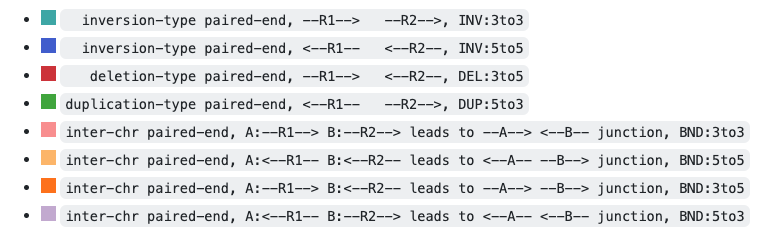

[](http://codeocean.com/product)

<hr>

# Visualization of genomic variants in Wally

Wally creates a genomic alignment plot of the region specified in the App Panel, based off of the Integrative Genomics Viewer.  


## Input data 
- In the **/data** directory, a genome in fasta format (```.fa``` ending) with an index created in Samtools that ends in ```.fa.fai```
- BAM file that has been trimmed, aligned to reference, sorted, duplicate marked, read groups adjusted if necessary, and indexed.  This capsule downloads data from an S3 bucket if a URL is provided in the App Panel. If no URL is provided, it will search for bam files in the **/data** directory.  It can use sample data from both locations in the same run. 
- Optional: a BED file with regions of interest
- Optional: genome annotations in a simple BED file. The BED file needs to be bgzipped and indexed via tabix (```tabix -p bed input.bed.gz```). The required columns are chromosome, start, end and an identifier which is displayed if there is sufficient space. The chromosome names of the genome FASTA file, BAM file and BED annotation file need to match.


## Outputs 
A plot showing the reads in the BAM file aligned to the reference genome, with base pair matches in gray and mismatches color coded by base. Coverage is shown in a histogram above the reads. 

## App Panel Parameters
### Main Parameters
- The URL of the S3 bucket with ```bam``` files, if they are not in the **/data** directory of this capsule. 
- The location to downolad the ```bam``` files from S3 [Default: /results/data]
- Chromosome to plot
- Start position of the genomic alignment plot
- End position of the genomic alignment plot
- Text to append to the output plot file name
- Path to the genome reference

### Auxilliary Parameters
- Minimum MAPQ quality for including paired end reads in the plotting. [Default: 1]
- BED file with regions to display
- Paired-end view. The paired-end coloring highlights candidate structural variants supported by read1 (R1) and read2 (R2). Below is a mapping of delly's structural variant types to wally's paired-end coloring. For inter-chromosomal translocations, it is assumed that R1 maps to chromosome A and R2 maps to chromosome B. [Default: no]

    [](https://github.com/tobiasrausch/wally)

- Show supplementary alignments [Default: no]
- Show soft- and hard-clips [Default: no]
- Number of horizontal images. The number of horizontal images can be specified in the alignment plots.  This can be used to zoom into a specific variant by adding another start and end position within the originals (the regions need to be separated by ```,``` without spaces).  You can split horizontally and vertically at the same time to view two regions, where one is not a subset of the other, for instance, a somatic inter-chromosomal translocation.  If you specify the regions in a BED file, then the split parameter operates row-wise, e.g., for -s 3 row 1-3 of the BED file make up the first image, row 4-6 the second image, and so on. [Default: 1]
- Width of the plot [Default: 1024]
- Height of the plot [Default: 1024]

## Citation

Tobias Rausch, Rene Snajder, Adrien Leger, Milena Simovic, Oliver Stegle, Ewan Birney, Marc Jan Bonder, Aurelie Ernst, Jan O. Korbel.
Long-read sequencing of diagnosis and post-therapy medulloblastoma reveals complex rearrangement patterns and epigenetic signatures.
bioRxiv 2022.02.20.480758

## Source

https://github.com/tobiasrausch/wally

<hr>

[Code Ocean](https://codeocean.com/) is a cloud-based computational platform that aims to make it easy for researchers to share, discover, and run code.<br /><br />
[](https://www.codeocean.com)

